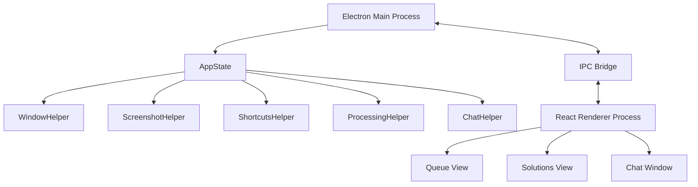
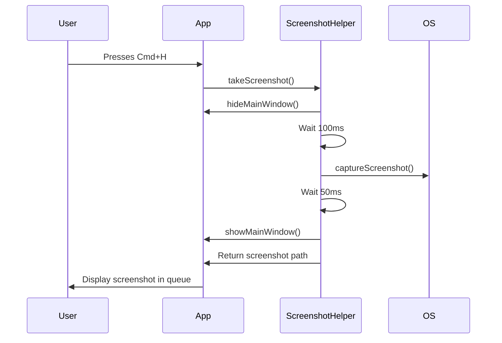
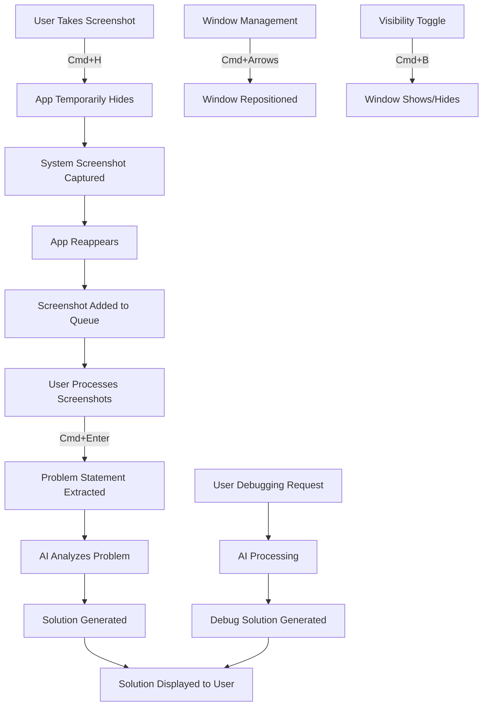

# Nexus-V: An Invisible Desktop Application


Nexus-V is a small experimental app I created out of curiosity and for learning purposes. The idea was inspired by platforms like InterviewCoder (with a lighthearted take on “F*ck LeetCode”), and it was developed after a day of exploration and research. My intention was never unethical  I simply wanted to understand how such platforms function behind the scenes and whether it was possible to recreate something similar for personal learning.

After analyzing how their system might work, I built a similar app with some extended features, such as live chat interaction, support from an MCP agent, and the ability to understand entire codebases while holding multiple conversations seamlessly. To keep things light and accessible, I wrote it in a simplified format, which may not be fully understandable to everyone at first glance.

One of the more interesting aspects of Nexus-V is its ability to provide real-time coding assistance by capturing screenshots, analyzing the content, and offering solutions  all while remaining invisible during screen recordings or screen sharing sessions. Again, this was built purely for educational exploration, with no intent to misuse or violate any ethical boundaries.

# How Actually all working

https://github.com/user-attachments/assets/10190418-4c1c-4ced-b5c0-6ef1b622d4d1

# This is how all screen recording applications and shared members see your screen
https://github.com/user-attachments/assets/76d5d7ad-4146-47d5-b4cb-8a9a2bef8702


## Invisibility Compatibility

The application is invisible to:

- Zoom versions below 6.1.6 (inclusive)
- All browser-based screen recording software
- All versions of Discord
- HackerRank
- CodeSignal
- zoom
- CoderPad
- amazon Chime
- Microsoft Teams
  
## Features

-  99% Invisibility: Undetectable window that bypasses most screen capture methods
-  Smart Screenshot Capture: Capture both question text and code separately for better analysis
-  AI-Powered Analysis: Automatically extracts and analyzes coding problems
-  Solution Generation: Get detailed explanations and solutions
- Real-time Debugging: Debug your code with AI assistance
-  Window Management: Freely move and position the window anywhere on screen
- Chat assistant with agentic workflow to under stand create flow anser 
  
## Architecture Overview



### Core Components

- **Main Process (Electron)**: Manages the application lifecycle and window behavior
- **AppState**: Central state manager that coordinates all helpers and maintains application state
- **WindowHelper**: Handles window creation, visibility, and positioning
- **ScreenshotHelper**: Manages screenshot capture and storage
- **ShortcutsHelper**: Registers global keyboard shortcuts
- **ProcessingHelper**: Processes screenshots to extract problem information
- **ChatHelper**: Provides chat interface for user interaction

## Why Is It Invisible: Technical Deep Dive

The invisibility of Nexus-V is achieved through a combination of Electron API features, OS-level window flags, and timing-based techniques. This section explains the technical mechanisms that make this possible.

### Exploiting Window Capture Methods

Screen recording and sharing applications typically use one of several methods to capture window contents:

1. **BitBlt/Screen Buffer Access**: Most capture software accesses the framebuffer or uses the BitBlt API to copy pixel data from screen regions.
2. **Window Enumeration**: Applications enumerate all visible windows and capture their contents.
3. **Composition APIs**: Modern applications use composition APIs provided by the OS.

Nexus-V exploits gaps in these mechanisms through:

#### 1. Content Protection Flag

In macOS, the `setContentProtection(true)` call activates the `NSWindowSharingNone` flag at the OS level. This is a built-in security feature designed to protect sensitive content from being captured:

```typescript
// In WindowHelper.ts, during window creation
this.mainWindow.setContentProtection(true);
```

This flag instructs the OS to exclude the window from screen captures and recordings, causing it to appear as a black box or be completely invisible in captures.

#### 2. Window Type Manipulation

By using the 'panel' window type on macOS and setting specific window properties, Nexus-V creates a window that operates outside the normal window management system:

```typescript
// Special window type configuration
type: process.platform === 'darwin' ? 'panel' : undefined,

// Additional macOS-specific configurations
if (process.platform === "darwin") {
  this.mainWindow.setVisibleOnAllWorkspaces(true, {
    visibleOnFullScreen: true
  });
  this.mainWindow.setAlwaysOnTop(true, "floating");
}
```

The 'panel' type with 'floating' level places the window in a different z-order layer than regular application windows, allowing it to be present on screen while being excluded from certain capture methods.

### Transparency and Rendering Tricks

Nexus-V uses a fully transparent window with properly configured alpha channels:

```typescript
const windowSettings: Electron.BrowserWindowConstructorOptions = {
  transparent: true,
  backgroundColor: "#00000000", // Fully transparent with alpha channel 0
  hasShadow: false,             // No window shadows that might be captured
  frame: false,                 // No window frame/chrome to capture
}
```

This transparency is combined with CSS styling in the React application that uses semi-transparent backgrounds only where needed, making the window appear solid to the user while remaining largely transparent to the system.

### Mission Control and System UI Integration

MacOS's Mission Control exposes all windows, but Nexus-V prevents this with:

```typescript
this.mainWindow.setHiddenInMissionControl(true);
```

This effectively removes the window from system-level UI interactions that might expose its presence.

### Screenshot Evasion Technique

Nexus-V implements a sophisticated timing-based technique to take screenshots without being included in them:

1. When a screenshot is requested, the window temporarily hides itself
2. The application waits a short delay to ensure the window is removed from the screen buffer
3. The screenshot is taken via native OS commands
4. The window reappears after another short delay

```typescript
public async takeScreenshot(): Promise<string> {
  // 1. Hide the main window
  hideMainWindow();
  
  // 2. Short delay to ensure window is hidden
  await new Promise((resolve) => setTimeout(resolve, 100));
  
  // 3. Take the screenshot using OS-native methods
  const screenshotBuffer = process.platform === "darwin"
    ? await this.captureScreenshotMac()
    : await this.captureScreenshotWindows();
  
  // 4. Save the screenshot
  // ... screenshot processing code ...
  
  // 5. Short delay before showing window again
  await new Promise((resolve) => setTimeout(resolve, 50));
  
  // 6. Show the window again
  showMainWindow();
  
  return screenshotPath;
}
```

This precise timing ensures the application can take screenshots without capturing itself.

### API Version Exploitation

Nexus-V takes advantage of specific API versions and behaviors:

- Zoom below version 6.1.6 uses a different screen capture method that can't detect the window
- Discord uses a capture API that doesn't support the content protection flag used by Nexus-V
- Web-based recording tools generally cannot access windows with content protection enabled

### Creating Your Own Invisible Application

To create a similar invisible application:

1. Use Electron with precise window configuration settings
2. Implement content protection and mission control hiding
3. Use transparent windows with minimal-required opacity
4. Implement precise timing for any screen interaction features
5. Test against various screen recording tools to identify which settings work best

## Invisibility Mechanisms

### Window Configuration

Nexus-V achieves invisibility through specific Electron BrowserWindow configurations:

```typescript
// From WindowHelper.ts
const windowSettings: Electron.BrowserWindowConstructorOptions = {
  frame: false,
  transparent: true,
  fullscreenable: false,
  hasShadow: false,
  backgroundColor: "#00000000",
  focusable: true,
  alwaysOnTop: true,
  type: process.platform === 'darwin' ? 'panel' : undefined
}
```

Key invisibility features:

1. **Content Protection**: `setContentProtection(true)` prevents window contents from being captured by screen recording applications
2. **Hidden in Mission Control**: `setHiddenInMissionControl(true)` keeps it hidden from macOS Mission Control
3. **Transparency**: Background is set to transparent (`"#00000000"`)
4. **Frameless Window**: `frame: false` removes window decorations
5. **Window Type**: Uses 'panel' window type on macOS, which behaves differently from standard windows

### Screenshot Technique

When taking screenshots, the application:

1. Temporarily hides itself: `hideMainWindow()`
2. Waits 100ms: `await new Promise((resolve) => setTimeout(resolve, 100))`
3. Captures the screen: `captureScreenshotMac()` or `captureScreenshotWindows()`
4. Waits 50ms: `await new Promise((resolve) => setTimeout(resolve, 50))`
5. Shows itself again: `showMainWindow()`




## Global Commands

The application uses unidentifiable global keyboard shortcuts that won't be detected by browsers or other applications:

- Toggle Window Visibility: [Control or Cmd + b]
- Move Window: [Control or Cmd + arrows]
- Take Screenshot: [Control or Cmd + H]
- Process Screenshots: [Control or Cmd + Enter]
- Reset View: [Control or Cmd + R]

## Technical Implementation Details

### Anti-Detection Features

1. **Window Attributes**: 
   - `setContentProtection(true)`: Prevents the window from being included in screenshots or recordings
   - `setHiddenInMissionControl(true)`: Hides the window from macOS system interfaces

2. **Window Visibility Handling**:
   ```typescript
   public showMainWindow(): void {
     // Shows the window but doesn't give it focus
     this.mainWindow.showInactive()
     
     // Maintains focus on the previous active window
     if (focusedWindow && !focusedWindow.isDestroyed()) {
       focusedWindow.focus()
     }
   }
   ```

3. **Window Type Configuration**:
   - On macOS, uses 'panel' type window with 'floating' level
   - Sets always-on-top behavior with correct z-ordering

### Electron Security Features

The application uses Electron's security features:
- Context isolation
- Sandboxed preload script
- Restricted IPC communication

## Working Model

Nexus-V operates on a multi-stage processing model that combines screenshot capture, AI processing, and user interaction:



### Data Flow

1. **User Input Layer**
   - Global shortcuts capture user commands
   - Screenshots are managed in a queue system
   - User interface allows manual actions

2. **Processing Layer**
   - Screenshot analysis extracts problem text and code
   - AI processing module structures the problem
   - Solution generation using external AI API

3. **Presentation Layer**
   - Transparent UI that renders correctly but remains invisible to recordings
   - Solutions view with syntax highlighting
   - Debugging interface with line-by-line analysis

### State Management

The application's `AppState` class serves as a central state manager, coordinating between modules:

```typescript
public readonly PROCESSING_EVENTS = {
  //global states
  UNAUTHORIZED: "procesing-unauthorized",
  NO_SCREENSHOTS: "processing-no-screenshots",
  API_KEY_OUT_OF_CREDITS: "processing-api-key-out-of-credits",

  //states for generating the initial solution
  INITIAL_START: "initial-start",
  PROBLEM_EXTRACTED: "problem-extracted",
  SOLUTION_SUCCESS: "solution-success",
  INITIAL_SOLUTION_ERROR: "solution-error",

  //states for processing the debugging
  DEBUG_START: "debug-start",
  DEBUG_SUCCESS: "debug-success",
  DEBUG_ERROR: "debug-error"
}
```

State transitions are communicated between the main process and renderer process using IPC channels, ensuring that the UI always reflects the current application state.


## Tech Stack

- Electron
- React
- TypeScript
- Vite
- Tailwind CSS
- Radix UI Components
- OpenAI API


