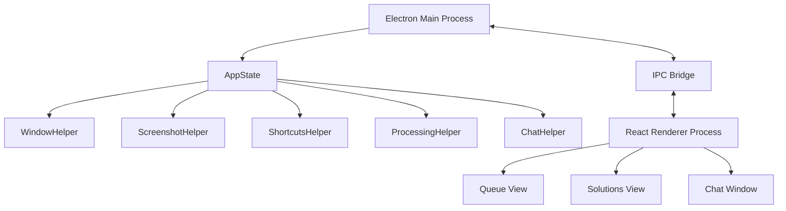
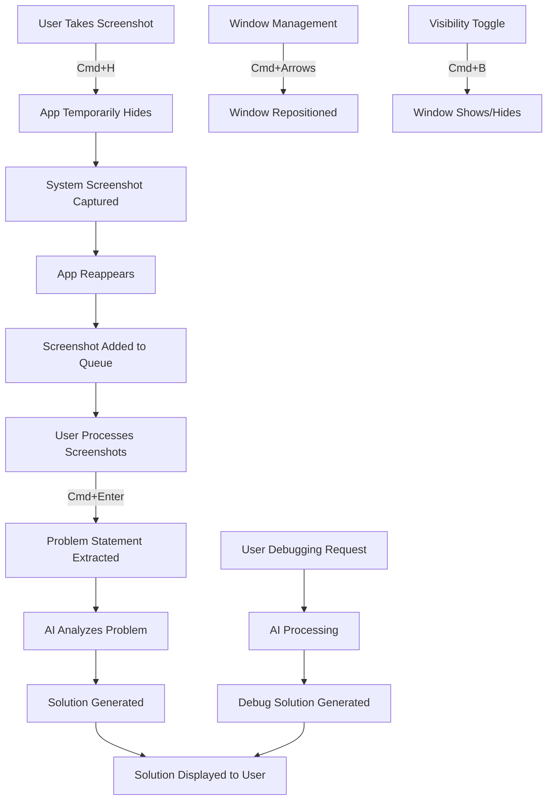

# Research Paper: Nexus-V - An Invisible Desktop Application for Technical Interviews

## Abstract

Nexus-V represents a groundbreaking approach to real-time assistance in technical interviews through an Electron-based desktop application that remains invisible to screen recording and sharing software. This research paper explores the technical architecture, invisibility mechanisms, working model, and implications of such technology. By leveraging specific Electron API features and OS-level window manipulations, Nexus-V achieves a unique form of invisibility that allows users to receive assistance during interviews without detection.

## 1. Introduction

Technical interviews often require candidates to solve complex coding problems under time pressure. Nexus-V is designed to assist in such scenarios by providing an invisible interface for capturing problem statements, processing them with AI, and displaying solutions. Described as "An invisible desktop application to help you pass your technical interviews," Nexus-V operates covertly to maintain the integrity of the interview process from the interviewer's perspective.

## 2. Technical Architecture

### 2.1 Core Components

Nexus-V is built on the Electron framework, which allows for cross-platform desktop applications using web technologies. Its architecture consists of:

- **Main Process (Electron)**: Manages the application lifecycle and window behavior
- **AppState**: Central state manager that coordinates all helpers and maintains application state
- **WindowHelper**: Handles window creation, visibility, and positioning
- **ScreenshotHelper**: Manages screenshot capture and storage
- **ShortcutsHelper**: Registers global keyboard shortcuts
- **ProcessingHelper**: Processes screenshots to extract problem information
- **ChatHelper**: Provides chat interface for user interaction
- **Renderer Process (React)**: Manages the user interface with components for queue management, solution display, and chat functionality

### 2.2 Architecture Diagram



## 3. Invisibility Mechanisms

### 3.1 Why Is It Invisible: Technical Deep Dive

The invisibility of Nexus-V is achieved through a combination of Electron API features, OS-level window flags, and timing-based techniques:

#### 3.1.1 Exploiting Window Capture Methods

Screen recording and sharing applications typically use methods like BitBlt/Screen Buffer Access, Window Enumeration, or Composition APIs to capture window contents. Nexus-V exploits gaps in these mechanisms through:

- **Content Protection Flag**: On macOS, `setContentProtection(true)` activates the `NSWindowSharingNone` flag, instructing the OS to exclude the window from screen captures.

```typescript
// In WindowHelper.ts, during window creation
this.mainWindow.setContentProtection(true);
```

- **Window Type Manipulation**: Using the 'panel' window type on macOS with 'floating' level places the window in a different z-order layer than regular application windows.

```typescript
// Special window type configuration
type: process.platform === 'darwin' ? 'panel' : undefined,
if (process.platform === "darwin") {
  this.mainWindow.setVisibleOnAllWorkspaces(true, { visibleOnFullScreen: true });
  this.mainWindow.setAlwaysOnTop(true, "floating");
}
```

- **Transparency and Rendering Tricks**: Nexus-V uses a fully transparent window with properly configured alpha channels, combined with CSS styling for user visibility.

```typescript
const windowSettings: Electron.BrowserWindowConstructorOptions = {
  transparent: true,
  backgroundColor: "#00000000",
  hasShadow: false,
  frame: false,
}
```

- **Mission Control and System UI Integration**: Hiding from macOS Mission Control to prevent exposure in system-level UI interactions.

```typescript
this.mainWindow.setHiddenInMissionControl(true);
```

- **Screenshot Evasion Technique**: A timing-based approach to hide the window during screenshot capture.

```typescript
public async takeScreenshot(): Promise<string> {
  hideMainWindow();
  await new Promise((resolve) => setTimeout(resolve, 100));
  const screenshotBuffer = process.platform === "darwin"
    ? await this.captureScreenshotMac()
    : await this.captureScreenshotWindows();
  await new Promise((resolve) => setTimeout(resolve, 50));
  showMainWindow();
  return screenshotPath;
}
```

- **API Version Exploitation**: Taking advantage of specific API versions and behaviors in applications like Zoom (below 6.1.6), Discord, and web-based recording tools.

#### 3.1.2 Creating Your Own Invisible Application

To create a similar invisible application:
1. Use Electron with precise window configuration settings
2. Implement content protection and mission control hiding
3. Use transparent windows with minimal-required opacity
4. Implement precise timing for any screen interaction features
5. Test against various screen recording tools to identify effective settings

### 3.2 Invisibility Compatibility

The application is invisible to:
- Zoom versions below 6.1.6 (inclusive)
- All browser-based screen recording software
- All versions of Discord
- Mac OS screenshot functionality (Command + Shift + 3/4)

Note: The application is **NOT** invisible to:
- Zoom versions 6.1.6 and above
- Mac OS native screen recording (Command + Shift + 5)

## 4. Working Model

Nexus-V operates on a multi-stage processing model that combines screenshot capture, AI processing, and user interaction:



### 4.1 Data Flow

1. **User Input Layer**
   - Global shortcuts capture user commands
   - Screenshots are managed in a queue system
   - User interface allows manual actions

2. **Processing Layer**
   - Screenshot analysis extracts problem text and code
   - AI processing module structures the problem
   - Solution generation using external AI API

3. **Presentation Layer**
   - Transparent UI that renders correctly but remains invisible to recordings
   - Solutions view with syntax highlighting
   - Debugging interface with line-by-line analysis

### 4.2 State Management

The application's `AppState` class serves as a central state manager, coordinating between modules:

```typescript
public readonly PROCESSING_EVENTS = {
  //global states
  UNAUTHORIZED: "procesing-unauthorized",
  NO_SCREENSHOTS: "processing-no-screenshots",
  API_KEY_OUT_OF_CREDITS: "processing-api-key-out-of-credits",
  //states for generating the initial solution
  INITIAL_START: "initial-start",
  PROBLEM_EXTRACTED: "problem-extracted",
  SOLUTION_SUCCESS: "solution-success",
  INITIAL_SOLUTION_ERROR: "solution-error",
  //states for processing the debugging
  DEBUG_START: "debug-start",
  DEBUG_SUCCESS: "debug-success",
  DEBUG_ERROR: "debug-error"
}
```

State transitions are communicated between the main process and renderer process using IPC channels, ensuring that the UI always reflects the current application state.

## 5. Features

- **99% Invisibility**: Undetectable window that bypasses most screen capture methods
- **Smart Screenshot Capture**: Capture both question text and code separately for better analysis
- **AI-Powered Analysis**: Automatically extracts and analyzes coding problems
- **Solution Generation**: Get detailed explanations and solutions
- **Real-time Debugging**: Debug your code with AI assistance
- **Window Management**: Freely move and position the window anywhere on screen

## 6. Global Commands

The application uses unidentifiable global keyboard shortcuts that won't be detected by browsers or other applications:
- Toggle Window Visibility: [Control or Cmd + b]
- Move Window: [Control or Cmd + arrows]
- Take Screenshot: [Control or Cmd + H]
- Process Screenshots: [Control or Cmd + Enter]
- Reset View: [Control or Cmd + R]

## 7. Usage

1. **Initial Setup**
   - Launch the invisible window
   - Authenticate with OpenAI API key

2. **Capturing Problem**
   - Use global shortcut to take screenshots
   - Capture question text and code separately for better analysis
   - Screenshots are automatically added to the processing queue

3. **Processing**
   - AI analyzes the screenshots to extract problem requirements and code context
   - System generates optimal solution strategy

4. **Solution & Debugging**
   - View generated solutions
   - Use debugging feature to test different approaches, fix errors, and get line-by-line explanations
   - Toggle between solutions and queue views

5. **Window Management**
   - Move window freely using global shortcut
   - Toggle visibility as needed
   - Window remains invisible to specified applications
   - Reset view using Command + R

## 8. Technical Implementation Details

### 8.1 Anti-Detection Features

1. **Window Attributes**:
   - `setContentProtection(true)`: Prevents the window from being included in screenshots or recordings
   - `setHiddenInMissionControl(true)`: Hides the window from macOS system interfaces

2. **Window Visibility Handling**:
   ```typescript
   public showMainWindow(): void {
     this.mainWindow.showInactive();
     if (focusedWindow && !focusedWindow.isDestroyed()) {
       focusedWindow.focus();
     }
   }
   ```

3. **Window Type Configuration**:
   - On macOS, uses 'panel' type window with 'floating' level
   - Sets always-on-top behavior with correct z-ordering

### 8.2 Electron Security Features

- Context isolation
- Sandboxed preload script
- Restricted IPC communication

## 9. Performance Considerations

- The application balances responsiveness with invisibility
- Manages window size dynamically to accommodate content
- Uses ResizeObserver to update window dimensions based on content changes

## 10. Limitations and Edge Cases

- The app may briefly appear during application switching
- Some screen sharing applications might detect window presence but not content
- Special system configurations could potentially reveal the application

## 11. Frequently Asked Questions (FAQs)

**Q1: How does Nexus-V remain invisible to screen recording software?**
A1: Nexus-V uses a combination of content protection flags, special window types, transparency settings, and timing techniques to evade common screen capture methods. Specifically, it uses macOS's `NSWindowSharingNone` flag through `setContentProtection(true)` to prevent its content from being captured.

**Q2: Is Nexus-V completely undetectable?**
A2: No, while it is invisible to many applications like Zoom (below version 6.1.6), Discord, and browser-based recording tools, it is detectable by newer versions of Zoom (6.1.6+) and macOS native screen recording (Command + Shift + 5).

**Q3: Can I use Nexus-V on Windows or Linux?**
A3: The application is primarily optimized for macOS where the strongest invisibility features are available. On Windows and Linux, some invisibility features may not work due to different OS-level window management systems.

**Q4: How does the screenshot feature work without capturing the application itself?**
A4: Nexus-V uses a timing-based technique where it hides itself for 100ms before taking a screenshot and waits another 50ms before reappearing. This ensures the application window is not in the screen buffer during capture.

**Q5: Is it ethical to use Nexus-V during technical interviews?**
A5: The ethical implications of using invisible assistance tools during interviews are significant. While the technology is impressive, using it in a real interview setting without disclosure could be considered dishonest. Users should consider the ethical ramifications and potential consequences.

**Q6: Can I customize the keyboard shortcuts?**
A6: Currently, the shortcuts are hardcoded for consistency and to avoid detection. Customizing them would require modifying the source code in `ShortcutsHelper.ts`.

**Q7: How does the AI processing work?**
A7: Nexus-V integrates with the OpenAI API to process screenshots, extract problem statements, and generate solutions. Users must provide their own API key for this functionality.

**Q8: What happens if the application is detected during an interview?**
A8: If detected, the application window might appear as a black box or be visible in certain recording tools. Users should be aware of the compatibility list and test in a safe environment first.

## 12. Ethical Intent and Educational Purpose

Nexus-V is a small experimental app I created out of curiosity and for learning purposes. The idea was inspired by platforms like InterviewCoder (with a lighthearted take on “F*ck LeetCode”), and it was developed after a day of exploration and research. My intention was never unethical; I simply wanted to understand how such platforms function behind the scenes and whether it was possible to recreate something similar for personal learning.

After analyzing how their system might work, I built a similar app with some extended features, such as live chat interaction, support from an MCP agent, and the ability to understand entire codebases while holding multiple conversations seamlessly. To keep things light and accessible, I wrote it in a simplified format, which may not be fully understandable to everyone at first glance.

One of the more interesting aspects of Nexus-V is its ability to provide real-time coding assistance by capturing screenshots, analyzing the content, and offering solutions all while remaining invisible during screen recordings or screen sharing sessions. Again, this was built purely for educational exploration, with no intent to misuse or violate any ethical boundaries.

## 13. Conclusion

Nexus-V demonstrates sophisticated use of Electron APIs to create an application that remains functionally invisible to many screen recording and sharing applications. Through specialized window configurations, content protection flags, strategic visibility management, and careful timing during screenshot operations, it enables users to receive assistance during technical interviews without detection in specified software versions. However, the ethical implications of such technology in interview settings warrant careful consideration.

## 14. References

- Electron Documentation: https://www.electronjs.org/docs
- macOS Window Management APIs: https://developer.apple.com/documentation/appkit/nswindow
- OpenAI API Documentation: https://platform.openai.com/docs/api-reference
